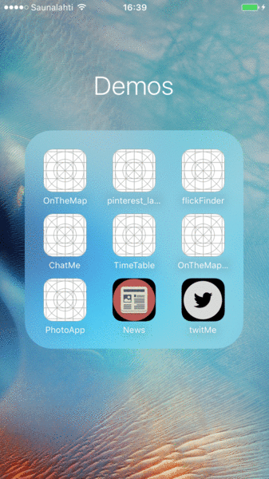

# README.md

## Introduction:

* This project demonstrates a newsreader app.

## Learning Objective:

* Here the objective is primarily to learn using Collection View

## How to use:

* Open "News" application
* Tap on any of the cell to open the news website.

## Technical Highlights:

* Custom CollectionViewCell
* Custom Section Headers
* Insert New Items
* Delete Items
* Move Items

## Status:

* Complete.

## Desired Further Enhancement:

* Connect to real world apis/feed apis

## Notes:
* Icon downloaded from (https://blog.agilebits.com/wp-content/uploads/2014/11/news-icon.png)
* Gif created with ezgif.com